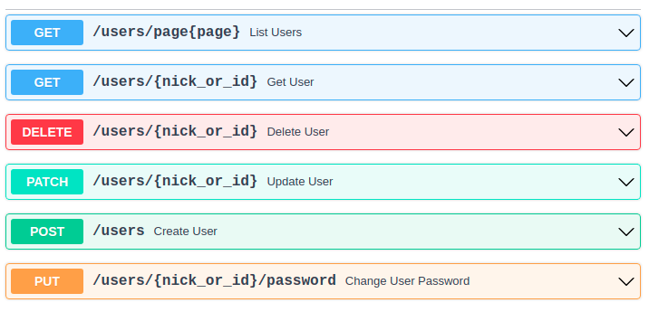

# FastAPI application example

Rewrote the example from the official umongo repository using FastAPI asynchronous code instead of Flask.
Переписал пример из официального репозитория umongo с использованием асинхроного кода на FastAPI, вместо Flask.

This application shows a simple API usecase. It uses:

- Motor as MongoDB async driver to use with μMongo
- FastAPI as python framework

http://127.0.0.1:8000/docs

TODO:
- [ ] написать тесты
- [ ] разобраться с umongo-моделями
- [X] реализовать автозаполнение данных

